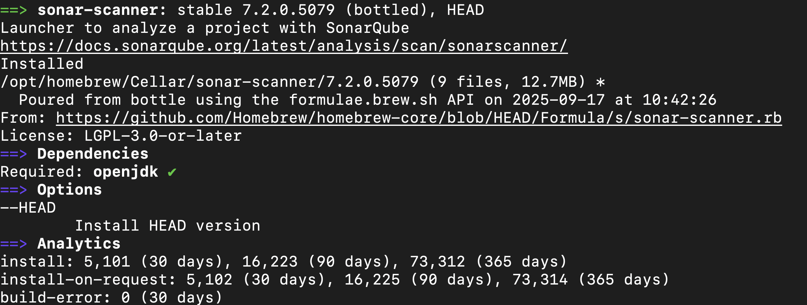
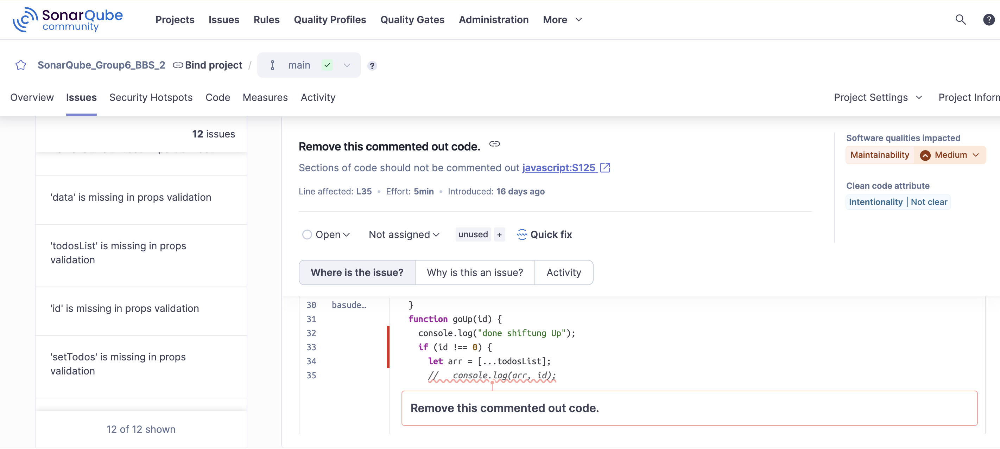
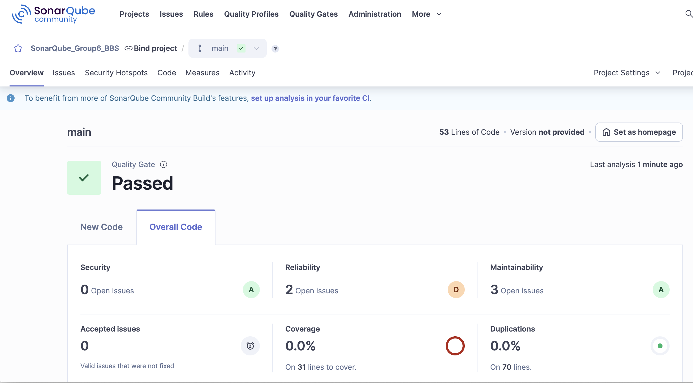

# SonarQube Analysis Group Work

Welcome to our Group! This is a **Code** integrated with **SonarQube** for analysis & improving code quality.  
Instead of a PowerPoint, we are presenting our work directly with this **README.md** on GitHub.

---

## 👥 Team Members

- 🌟 Basu
- 🌟 Benitta
- 🌟 Saara

---

## 🎯 Project Overview

We are trying to play with **SonarQube** to analyze the code.  
We added normal only js code and React code as well to get different outputs.

Main objective: Apply **SonarQube** for static code analysis

---

## 🧪 SonarQube Analysis

We used **SonarQube** to analyze our code.  
It helped us identify:

- 🐛 Bugs
- ⚠️ Code smells
- 🛡️ Security vulnerabilities

### SonarQube Steps to work with Code:

### 1. Install **SonarCube** from docker Hub to Docker(Local)

- **Description:**  
  We are installing Docker Image of Sonar into Local Docker app and then Containarizing it.

- **Step 1 – Pull SonarQube Image**


- **Step 2 – Run Container**

```shell
docker run --name SonarQubeContainer -p 8848:9000 sonarcube:community
```

Make sure the container running with: `Docker ps`


---

### 2. Install **sonar-scanner** from Homebrew.

- **Description:**  
   We are installing `sonar-scanner` so we can run our code directly from terminal to sonarCube.<br>

```
brew install sonar-scanner
```

Make sure the sonar-scanner installed with :

```
brew info sonar-scanner
```



---

### 3. Setup Project in **sonar-scanner** .

- **Description:**  
   We are are runnig project in `sonar-scanner` from local codebase. Followings are the steps:: <br>

- **Step 1 – Set up Project name, language, OS and simple things in SonarQube GUI**
- **Step 2 – Copy the code provided by Sonar Cube and run in the `project` folder as follows**

```
sonar \
  -Dsonar.host.url=http://localhost:8848 \
  -Dsonar.token=sqp_ef3e51fbef5fd38061778e0d4484d6fbe2ac3fcb \
  -Dsonar.projectKey=Group_project_sonarQube
```

Then we will see something like this :


List of `errors` here :<br>

<table align="center">
  <tr>
    <td></td>
    <td></td>
  </tr>
</table>

  <br>
<div align="center" style="display: flex; justify-content: center; gap: 5px;">
  
</div>
  <br>

### After fixing here :<br>

  

---

### SonarQubeCloud Steps to Analyze Remote Code from GitHub:

### 1. Log in, In **SonarCube Cloud** using **Github** and Authorize it :

### 2. Connect Github and **SonarCube Cloud** using **Github** and Authorize it :

- **Description:**  
  We are connecting Github repo in SonarQubeCloud<br>

<table align="center">
  <tr>
    <td></td>
    <td></td>
  </tr>
</table>

<hr>
<div align="center">
  <!--  -->
  
  <br>
  <!--  -->
  
</div>

## Badges In SonarQube

<table align="center">
  <tr>
    <td></td>
    <td></td>
  </tr>
</table>

## 💡 Conclusion – Thoughts about SonarQube

- ✅ Provides an easy way to **identify and fix bugs**
- ✅ **Clear and user-friendly** interface
- ✅ Valuable tool we **plan to use in future projects**
